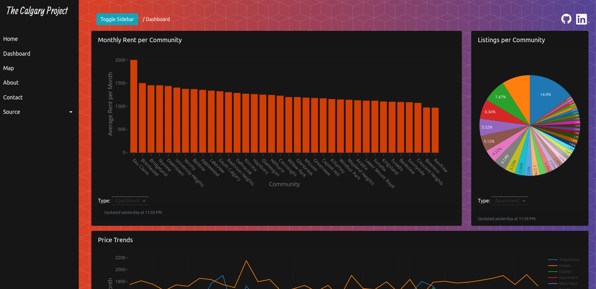

# The Calgary Project
>A cloud native analysis service for the rental property market.

The Calgary Project is a scalable, open source initiative for analyzing Calgary's rental market. Content is served from a series of independent cloud docker instances and custom CDN's. 

A carefully designed data engineering/ETL process creates a cohesive story out of the raw data. Interactive analytics allow users to gain an accurate understanding of market trends, discrepancies, and opportunities. 

Data collection for this project is housed at the [Rental Data ETL](https://github.com/agmoss/Rental-Data-ETL) GitHub project.

# Screenshot
>Part of the dashboard...

# Development Status

This project implements the principles of CI & CD. The latest development is housed at: http://calgaryproject.azurewebsites.net/

This is a work in progress and development is ongoing. 

## Built With

### Code
* [Django](https://www.djangoproject.com/) - Web framework
* [Plotly.js](https://plot.ly/javascript/) - Plotly Javascript Open Source Graphing Library
* [Leaflet.js](https://leafletjs.com/) - Javascript library for interactive maps
* [Pandas](https://pandas.pydata.org/) - Python data analysis library

### Services
* [Microsoft Azure](https://azure.microsoft.com/en-ca/) - Cloud service
* [Docker](https://www.docker.com//) - Virtualization

## Contributing

Constructive criticism and feedback is more than welcome!

## Authors

* **Andrew Moss** - *Creator* - [agmoss](https://github.com/agmoss)

## License

This project is licensed under the MIT License - see the [LICENSE.md](LICENSE.md) file for details

## Acknowledgments

* Rentfaster.ca
